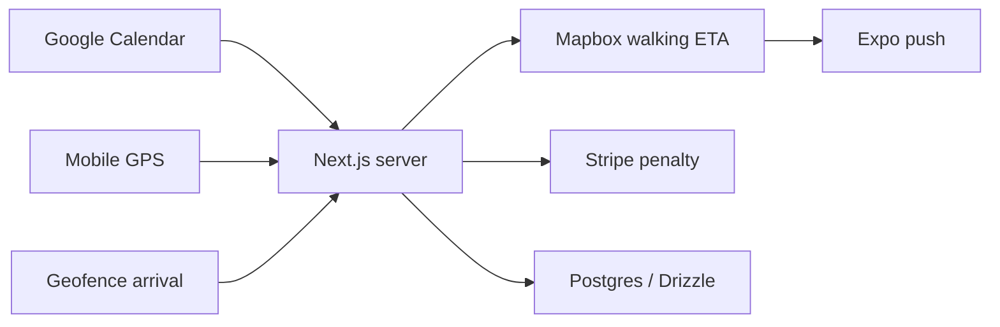

# Go

<p align="center">
  
</p>

iOS commitment device. Charges me when I am late.

Live: https://go-place.vercel.app

## What it does

Go reads my Google Calendar, computes a walking ETA from my current GPS to each event's geocoded address, sends a leave-now push, and uses a destination geofence to decide whether I arrived early enough.

If I miss the commitment, an off-session Stripe charge fires against my own card. Removing a payment method takes seven days. The anti-escape mechanism is the product.

The original working title was Class on Time; the product name is Go.

## Core loop

1. Connect Google Calendar.
2. Detect events with physical locations.
3. Compute walking ETA and required departure time.
4. Send a leave-now push notification.
5. Use a destination geofence to decide whether the user arrived on time.
6. Charge the configured penalty if they did not.

## What is built

- Expo iOS app with location, push notifications, onboarding, roll call, settings, and a route surface.
- Next.js server with App Router API routes on Vercel.
- Drizzle schema and migrations for users, events, arrivals, payment methods, charges, lockups, and integrations.
- Google Calendar sync and location-aware event detection.
- Stripe setup for Apple Pay / Financial Connections.
- Voice roll call: a Claude Haiku classifier listens to the user's plan and confirms or cancels commitments.
- Seven-day payment-method removal lockup so the user cannot escape the commitment at the last second.

## Architecture



## Stack

Expo, Next.js 16, TypeScript, Neon Postgres, Drizzle, Mapbox, Stripe Financial Connections, Google Calendar, Whisper, Claude Haiku, Vercel, and GitHub Actions cron.

## Repo layout

- `apps/mobile` - Expo iOS app
- `apps/server` - Next.js server, API routes, Vercel cron, Stripe, Google Calendar
- `packages/db` - Drizzle schema and migrations
- `packages/shared` - Shared TypeScript types

## Status

Private alpha. Marketing site is live; iOS app runs in an EAS dev client.

## Run locally

```bash
npm install
npm run dev:server
npm run dev:mobile
```

Environment variables live in `apps/server/.env.local` and `apps/mobile/.env.local`.
